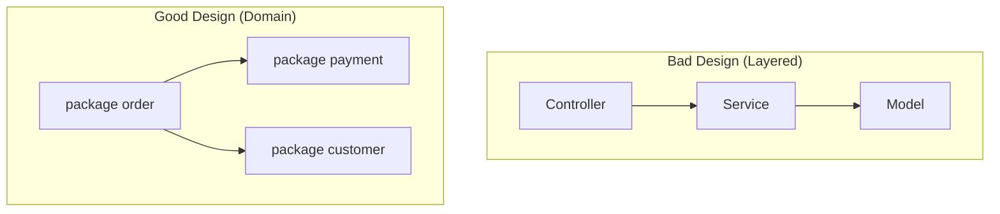

# Go Architecture & Design Guidelines

> [!IMPORTANT]
> **Core Principle**: Make invalid states unrepresentable. Design your code so that it is impossible to misuse.

## 1. Package Design principles
**Goal**: Small, focused, reusable components.

*   **Small & Focused**: Packages should do one thing and do it well.
*   **File Organization**:
    *   **Prefer Files over Directories**: Do not create generic sub-directories like `model/`, `service/`, or `types/` inside your package.
    *   **Correct**: `feature/types.go`, `feature/service.go`.
    *   **Incorrect**: `feature/models/types.go`, `feature/services/service.go`.
*   **Splitting Rule (The "Too Big" Test)**:
    *   If a package grows large enough that you feel the need to create a `models/` directory to organize multiple model files, **the package is too big**.
    *   **Action**: Break it down into smaller, focused sub-packages (e.g., `feature/subfeature1`, `feature/subfeature2`).
*   **Hierarchy**: Nested packages are permitted and encouraged for grouping related sub-features, as long as they adhere to the circular dependency rule.
*   **Strict Rule**: **NO Circular Dependencies**. If you hit a circular dependency, your design is wrong. Refactor by extracting common definitions to a third package or decoupling via interfaces.



> [!CAUTION]
> **ANTI-PATTERN 1**: Grouping by layer (Global)
> *   `controllers/`, `models/`, `services/`
>
> **ANTI-PATTERN 2**: Internal Layering (Inside Package)
> *   `pkg/user/models/user.go`
> *   `pkg/user/services/register.go`
>
> **CORRECT**: Grouping by feature/domain & Flat Package Files
> *   `pkg/order/`, `pkg/payment/`
> *   `pkg/user/types.go`
> *   `pkg/user/register.go`
> *   `pkg/user/register.go`
> *   `pkg/user/registration/register.go` (if complex)

> [!CAUTION]
> **ANTI-PATTERN**: The "Junk Drawer" (Utils/Common)
> *   **Bad**: `feature/utils` or `feature/common` containing mixed logic (strings, encryption, formatting).
> *   **Why**: Violates cohesion. It becomes a dumping ground where dependencies tangle.
> *   **Solution**: Group by **what it operates on** or **domain**.
>     *   String helpers -> `feature/text` or `internal/strutil`
>     *   Time helpers -> `feature/timeext`
>     *   Domain logic -> `feature/auth/hashing` (NOT `feature/auth/utils`)
> *   **Exception**: A single `feature/utils` is permissible **ONLY IF** it relies strictly on the **Standard Library**. Once a function imports a 3rd party dependency, it MUST be moved to a specific package to prevent polluting the dependency tree.

## 2. Interfaces: Consumer-Defined
**Goal**: Decoupling and testability.

*   **Define where used**: Do NOT define interfaces in the implementing package. Define them in the consumer package.
*   **Small Interfaces**: Keep interfaces minimal (`Reader` vs `ReadWriteCloser`).

**Example**:
If `service` uses a database, `service` defines the `Repository` interface. The `database` package implements it.

```go
// package service
type UserRepository interface {
    Find(id string) (*User, error) // Defined here, where it's used
}

type Service struct {
    repo UserRepository
}
```

> [!CAUTION]
> **ANTI-PATTERN**: Pre-emptive Interface Return
> *   **Bad**: `func NewService() ServiceInterface { ... }`
> *   **Good**: `func NewService() *Service { ... }`
> *   **Rule**: **Accept Interfaces, Return Concrete Types.**
> *   **Why**: Returning interfaces pre-emptively limits the consumer's ability to use the full feature set of the struct and confuses the API surface.

> [!CAUTION]
> **ANTI-PATTERN**: Leaky Interfaces
> *   **Bad**: `Save(u *User) (sql.Result, error)`
>     *   *Why*: `sql.Result` ties your interface to a SQL database. You can't implement this for a file system or memory store.
> *   **Good**: `Save(u *User) (string, error)`
>     *   *Why*: Returns the data you actually need (the new ID) in a generic way, without leaking implementation details.

## 3. Structs & Encapsulation
**Goal**: Control state and enforce invariants.

*   **Private Fields**: All Domain Entity fields MUST be private.
*   **Public Constructor**: You MUST provide a public `New...` constructor for every Domain Entity.
    *   **Strict Rule**: Direct initialization with `{}` is **forbidden** for Domain Entities, even if they currently have no validation logic.
    *   **Reason**: Future-proofing. If you add validation later, you shouldn't have to refactor every usage.
*   **DTOs**: Use separate **Data Transfer Objects** (DTOs) with public fields for simple data passing (JSON, API) where no behavior/validation is attached.

```go
// Domain Entity
type User struct {
    id    string // Private: immutable once created
    email string // Private: validated format
}

// DTO
type UserDTO struct {
    ID    string `json:"id"`
    Email string `json:"email"`
}
```

> [!CAUTION]
> **ANTI-PATTERN**: Constructor Bypass
> *   **Bad**: `user := &User{email: "..."}`
> *   **Good**: `user := NewUser("...")`
> *   **Why**: Bypassing the constructor skips validation and makes it impossible to guarantee invariants. It also breaks encapsulation.

> [!CAUTION]
> **ANTI-PATTERN**: Tag Pollution on Domain Entities
> *   **Rule**: NEVER add `json:"..."`, `yaml:"..."`, or ORM tags (`gorm:"..."`) to **Domain Entities** (private structs).
> *   **Reason**: This couples your pure business logic to specific external interfaces or database implementations.
> *   **Solution**: Always use dedicated DTOs for serialization and separate DB Models for persistence.

## 4. Validation Strategy
**Goal**: Trust your objects.

### Type A: Static Validation (Invariants)
*   **Where**: Inside the Constructor (`New...`).
*   **Guarantee**: It is **impossible** to create an instance of the struct if these pass fail.
*   **Scope**: Internal consistency (e.g., "ID cannot be empty", "Email must have @").

```go
func NewUser(id, email string) (*User, error) {
    if id == "" {
        return nil, errors.New("id is required")
    }
    if !strings.Contains(email, "@") {
        return nil, errors.New("invalid email") // Static check
    }
    return &User{id: id, email: email}, nil
}
```

### Type B: Dynamic Validation (Business Rule / External)
*   **Where**: First thing in the method body.
*   **Scope**: Depends on external state (e.g., "File exists", "User is unique in DB").
*   **Requirement**: You MUST strictly separate and comment the validation section from the actual implementation logic to ensure readability.

```go
func (u *User) Save(repo UserRepository) error {
    // 1. Dynamic Validation
    if exists := repo.Exists(u.id); exists {
        return errors.New("user already exists")
    }

    // 2. Implementation
    return repo.Save(u)
}
```

## 5. Dependency Injection (DI) & Testing
**Goal**: Deterministic, isolated tests.

*   **Strict DI**: dependencies MUST be passed via constructor.
*   **No Globals**: Never use global state for dependencies.
*   **Testing**:
    *   **Mocks**: Use mocks for all dependencies.
    *   **No Temp Files**: Do not touch the filesystem in unit tests. Mock the `FileSystem` interface.
    *   **No Temp Dirs**: Do not use `os.TempDir` or `t.TempDir()` in unit logic tests.

**Correct Usage**:

```go
// Service definition
type FileProcessor struct {
    fs FileSystem // Interface
}

// Construction
func NewFileProcessor(fs FileSystem) *FileProcessor {
    return &FileProcessor{fs: fs}
}

// Testing
func TestFileProcessor(t *testing.T) {
    mockFS := new(MockFileSystem) // Mock implementation
    processor := NewFileProcessor(mockFS)
    // Test logic without touching disk
}
```

